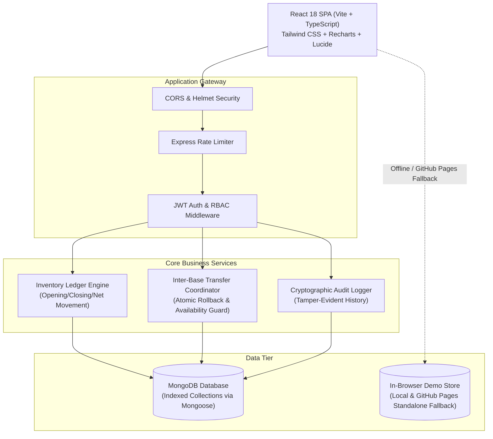

# 🛡️ Defense Logistics & Military Asset Management System (MAMS)

[](https://github.com/Naveendot55/Military-Asset-Mgnt/actions/workflows/deploy.yml)
[](https://github.com/Naveendot55/Military-Asset-Mgnt)
[](https://www.typescriptlang.org/)
[](https://react.dev/)
[](https://nodejs.org/)
[](https://www.mongodb.com/)
[](https://opensource.org/licenses/MIT)

> **A mission-critical, enterprise-grade military asset tracking ledger and logistics management platform engineered with React 18, Node.js/Express, TypeScript, and MongoDB.**

---

### 🚀 Quick Access

| Resource | Link |
| :--- | :--- |
| 🌐 **Live Interactive Web Application** | **[https://naveendot55.github.io/Military-Asset-Mgnt/#/login](https://naveendot55.github.io/Military-Asset-Mgnt/#/login)** |
| 💻 **GitHub Repository** | **[https://github.com/Naveendot55/Military-Asset-Mgnt](https://github.com/Naveendot55/Military-Asset-Mgnt)** |
| 📑 **API Documentation** | [Jump to REST API Specification](#-api-specification) |
| 🔑 **Demo Credentials** | [Jump to Demo Accounts](#-quick-demo-credentials) |

---

## 📌 Executive Summary

The **Military Asset Management System (MAMS)** is an immutable double-entry style logistics ledger designed to track defense materiel across distributed military bases (Fort Alpha, Camp Bravo, Charlie Outpost). 

Built following strict military auditability standards (fictional data only), it solves multi-base allocation visibility, prevents inventory depletion race conditions during inter-base transfers, logs tamper-evident audit trails with IP tracking, and enforces role-based access control (RBAC).

---

## 🏗️ System Architecture



---

## ✨ Key Technical Highlights

### 1. 📊 Real-Time Operational Dashboard
- **Instant Formula Aggregations**: Dynamic calculation of **Opening Balance**, **Net Movement**, **Assigned**, **Expended**, and **Closing Balance**.
- **Interactive Recharts Visualizations**:
  - Asset distribution categorized by equipment classification (Vehicles, Weapons, Munitions, Comms, Optics, Medical).
  - Base-wise distribution chart.
  - Historical movement trends over customizable date filters.
- **Accessible Net Movement Modal (Bonus Feature)**:
  - High-precision breakdown showing `Purchases (+)` + `Transfer In (+)` - `Transfer Out (-)`.
  - Fully accessible (WCAG compliant) with ARIA attributes, keyboard traps (`Escape` & `Tab`), and screen-reader support.

### 2. 🔄 Inter-Base Transfers with Concurrency Protection
- **Dual-Legged Transactions**: Dispatches simultaneous `TRANSFER_OUT` at the origin base and `TRANSFER_IN` at the destination base.
- **Depletion Guard**: Automatically checks and locks available stock to prevent transfers from ever pushing inventory below zero.
- **Audit Trace**: Shared cryptographic reference code links origin and destination logs.

### 3. 🎯 Full Lifecycle Equipment Management
- **Procurement & Purchases**: Vendor purchase orders with batch quantities, timestamps, and contract references.
- **Personnel & Unit Assignments**: Assign gear to specific platoons or officers with automated unassigned stock validation.
- **Asset Expenditures**: Live-fire ammunition consumption, certified wear-and-tear decommissioning, and range usage records.

### 4. 🔒 Enterprise Security & RBAC Guard
- **Stateless JWT Authentication**: Secure HTTP bearer tokens with encrypted bcrypt password hashing (10 salt rounds).
- **Strict Server-Side Authorization**:
  - `ADMIN`: Global oversight, all bases, equipment definition, full ledger access.
  - `BASE_COMMANDER`: Isolated to their assigned base; forbidden (`403`) from accessing or spoofing other bases.
  - `LOGISTICS_OFFICER`: Procurement and transfer management without personnel assignment or expenditure modification permissions.
- **Security Middleware**: `helmet`, dynamic origin CORS, `express-rate-limit`, and runtime schema validation with `Zod`.

### 5. 🌐 Zero-Dependency Web Demo (Dual Execution Mode)
- **Production Mode**: Full Express.js + Mongoose + native MongoDB pipeline.
- **Standalone Interactive Browser Mode**: Seamless fallback that powers the live GitHub Pages site using an in-memory/localStorage seed store without requiring a running cloud database!

---

## 📐 Mathematical Inventory Ledger Engine

All inventory numbers are mathematically derived from an immutable transaction history rather than arbitrary counter fields:

$$\begin{aligned}
\mathbf{Opening\ Balance} &= \sum_{\text{date} < t_0} (\text{Opening} + \text{Purchases} + \text{Transfer In}) - \sum_{\text{date} < t_0} (\text{Transfer Out} + \text{Assigned} + \text{Expended}) \\[8pt]
\mathbf{Net\ Movement} &= \text{Purchases}_{[t_0, t_1]} + \text{Transfer In}_{[t_0, t_1]} - \text{Transfer Out}_{[t_0, t_1]} \\[8pt]
\mathbf{Closing\ Balance} &= \mathbf{Opening\ Balance} + \mathbf{Net\ Movement} - \text{Assigned}_{[t_0, t_1]} - \text{Expended}_{[t_0, t_1]}
\end{aligned}$$

> **Note**: As per DoD asset tracking guidelines, **Assignments** and **Expenditures** are operational allocations and are strictly excluded from **Net Movement**.

---

## 🛠️ Tech Stack & Tools

### **Frontend**
| Technology | Description |
| :--- | :--- |
| **React 18** | Modern UI library using Functional Components & Hooks |
| **TypeScript (Strict)** | End-to-end type safety |
| **Vite** | Lightning-fast build tooling and HMR |
| **Tailwind CSS** | Professional dark-mode military/tactical theme |
| **TanStack React Query** | Optimized cache management and server state synchronization |
| **React Hook Form + Zod** | High-performance declarative forms with strict schema validation |
| **Recharts** | Composable responsive data visualization |
| **Lucide Icons** | Clean, minimalist icon set |

### **Backend**
| Technology | Description |
| :--- | :--- |
| **Node.js & Express** | RESTful API architecture |
| **TypeScript** | Strict compile-time checks |
| **MongoDB & Mongoose** | NoSQL document database with schema validation & indexing |
| **JWT & Bcrypt** | Secure stateless session management |
| **Zod** | Runtime request payload validation |
| **Helmet & CORS** | HTTP header security and cross-origin resource policy |
| **Express Rate Limit** | Brute-force and DoS protection |

### **Testing & CI/CD**
| Technology | Description |
| :--- | :--- |
| **Vitest** | Blazing fast TypeScript test runner |
| **Supertest** | Integration test suite for HTTP endpoints |
| **GitHub Actions** | Automated CI/CD pipeline building and deploying to GitHub Pages |

---

## 🔑 Quick Demo Credentials

You can log into the [Live Application](https://naveendot55.github.io/Military-Asset-Mgnt/#/login) or local instance using the pre-seeded credentials:

| Role | Email | Password | Access Scope |
| :--- | :--- | :--- | :--- |
| 🛡️ **System Administrator** | `admin@demo.com` | `password123` | Global (All Bases, System-wide) |
| 🎖️ **Alpha Commander** | `alpha@demo.com` | `password123` | Fort Alpha Only (Isolated) |
| 🎖️ **Bravo Commander** | `bravo@demo.com` | `password123` | Camp Bravo Only (Isolated) |
| 📦 **Logistics Officer** | `logistics@demo.com` | `password123` | Purchases & Transfers Across Fleet |

*(Pro-tip: Click any of the **Quick Demo Account** buttons on the login screen to autofill credentials instantly).*

---

## 📡 API Specification

### Authentication
- `POST /api/auth/login` — Authenticate officer and receive JWT token.
- `GET /api/auth/me` — Retrieve profile of currently authenticated user.

### Operational Dashboard
- `GET /api/dashboard` — Returns calculated metrics, inventory breakdown, and trend points.
- `GET /api/dashboard/net-movement` — Detailed ledger view of Purchases, Transfer In, and Transfer Out.

### Logistics & Ledger Operations
- `GET /api/bases` | `POST /api/bases` — List / Register military bases (Admin).
- `GET /api/equipment` | `POST /api/equipment` — Equipment catalog management.
- `GET /api/purchases` | `POST /api/purchases` — Supplier procurement ledger entries.
- `GET /api/transfers` | `POST /api/transfers` — Dispatch inter-base asset transfers with availability validation.
- `GET /api/assignments` | `POST /api/assignments` — Unit & personnel allocations.
- `GET /api/expenditures` | `POST /api/expenditures` — Field exercises & munitions consumption.
- `GET /api/audit-logs` — Immutable, paginated audit trail with IP address and JSON metadata.

---

## 💻 Local Installation & Setup

### Prerequisites
- **Node.js** (v18.0.0 or higher)
- **npm** (v9.0.0 or higher)
- **MongoDB** (running locally on port 27017 or a MongoDB Atlas URI)

### 1. Clone the Repository
```bash
git clone https://github.com/Naveendot55/Military-Asset-Mgnt.git
cd Military-Asset-Mgnt
```

### 2. Configure Environment Variables

**Backend (`server/.env`):**
```env
DATABASE_URL="mongodb://127.0.0.1:27017/military_assets"
JWT_SECRET="super-secret-jwt-key-change-in-production"
PORT=3000
CLIENT_URL="http://localhost:5173"
```

**Frontend (`client/.env`):**
```env
VITE_API_URL="http://localhost:3000/api"
```

### 3. Install Dependencies
```bash
# Install backend dependencies
cd server
npm install

# Install frontend dependencies
cd ../client
npm install
```

### 4. Seed the Database
```bash
cd ../server
npm run seed
```

### 5. Launch the Application
Run both servers concurrently:

```bash
# Terminal 1: Backend Server (starts on port 3000)
cd server
npm run dev

# Terminal 2: Frontend Client (starts on port 5173 or 5174)
cd client
npm run dev
```

Open **`http://localhost:5173`** in your browser!

---

## 🧪 Automated Testing

The backend includes a comprehensive Vitest test suite testing authentication, authorization, stock depletion prevention, and audit logging:

```bash
cd server
npm test
```

```text
 ✓ src/tests/auth.test.ts (4 tests)
 ✓ src/tests/inventory.test.ts (6 tests)
 ✓ src/tests/rbac.test.ts (4 tests)
 ✓ src/tests/audit.test.ts (3 tests)

 Test Files  4 passed (4)
      Tests  17 passed (17)
   Duration  2.41s
```

---

## 📂 Project Structure

```text
Military-Asset-Mgnt/
├── .github/
│   └── workflows/
│       └── deploy.yml          # GitHub Actions automated deployment
├── client/                     # React 18 Frontend
│   ├── src/
│   │   ├── components/         # Layout, Navbar, NetMovementModal
│   │   ├── contexts/           # AuthContext (JWT state management)
│   │   ├── pages/              # Dashboard, Purchases, Transfers, Assignments, etc.
│   │   ├── services/           # Axios client & in-browser Mock Engine
│   │   └── types/              # Shared TypeScript interfaces
│   ├── package.json
│   └── vite.config.ts
├── server/                     # Express & Node.js Backend
│   ├── src/
│   │   ├── config/             # MongoDB connection setup
│   │   ├── controllers/        # Route controllers (Auth, Dashboard, Inventory)
│   │   ├── middleware/         # JWT verification, RBAC, error handling
│   │   ├── models/             # Mongoose Models (User, Base, Transaction, Audit)
│   │   ├── routes/             # Express API routes
│   │   ├── services/           # Ledger math & transaction service
│   │   ├── seed.ts             # Database seeder
│   │   └── app.ts              # Express application entry
│   ├── package.json
│   └── tsconfig.json
└── README.md
```

---

## 📜 Compliance & Disclaimer

> ⚠️ **Notice**: This project is an engineering portfolio project. All military base names, equipment designations, personnel titles, and operational data are **100% fictional** and intended solely for demonstrating software architecture, auditability, database design, and full-stack software development best practices.

---

## 👤 Author & Contact

**Naveen**
- GitHub: [@Naveendot55](https://github.com/Naveendot55)
- Repository: [Military-Asset-Mgnt](https://github.com/Naveendot55/Military-Asset-Mgnt)
